# ANYmal-C 四足运动控制强化学习 —— 从 Isaac Lab 到 MuJoCo 的跨引擎验证

**MuJoCo 跨引擎验证**（同一份 ONNX 权重，从 PhysX 换到 MuJoCo）：

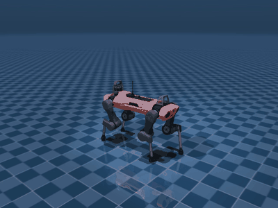

**崎岖地形泛化**（观测 235 维，含地形高度扫描）：

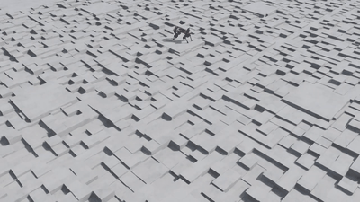

> **English**: PPO-based velocity-tracking locomotion policy for the ANYmal-C quadruped, trained in
> Isaac Lab (Isaac Sim 5.1 / PhysX, 1024 parallel environments, ~98M env steps), exported to ONNX
> (max numerical deviation 9.5e-07) and re-validated in **MuJoCo** — a different physics engine —
> achieving 6/6 full 20-second episodes with a mean velocity-tracking error of **0.036 m/s**.
> Includes perturbation-robustness ablation (fall rate 69.4% → 9.3% at ±2.0 m/s), rough-terrain
> generalization, and a **ROS2 deployment stack** with quantified hardware limits (inference p99
> 0.26 ms; observation-delay tolerance ≈ 80 ms).

---

## 0. 任务来源与本项目工作（先读这一节）

**任务来源**：训练使用 **Isaac Lab 官方自带任务** `Isaac-Velocity-Flat-Anymal-C-v0`
（任务定义、环境、**奖励函数与 PPO 实现均来自官方**，本项目未修改算法和奖励函数；
训练超参与迭代轮数也为标准配置）。

**因此，"训练"本身是基准复现，不是本项目的贡献。本项目的工作是下面这些：**

| # | 工作 | 对应章节 |
|---|---|---|
| 1 | 训练环境搭建与基准复现（Windows 原生 + 驱动/依赖问题排查） | §2、§6.4 |
| 2 | ONNX 导出与数值一致性验证（9.5e-07） | §2 |
| 3 | **MuJoCo 跨引擎验证**（同一策略换物理引擎，6/6 通过） | §2 |
| 4 | **外部扰动鲁棒性评估 + 抗扰动训练消融**（69.4% → 9.3%） | §2 |
| 5 | 地形泛化对比（平地 vs 崎岖地形） | §2 |
| 6 | **ROS2 部署栈 + 部署边界量化**（延迟容限、估计噪声敏感性） | §2、`deploy/` |
| 7 | 部署栈跨平台复现（Windows 原生 / WSL2） | `deploy/README.md` |

---

## 1. 项目简介

用强化学习训练 ANYmal-C（ANYbotics 工业四足机器人）**速度跟踪**策略：随机下达前后/侧向/转向速度指令，
策略输出 12 个关节的目标角度，使机器人平稳跟踪指令且不摔倒（任务来自 Isaac Lab 官方，见第 0 节）。

项目重点不在"训出来"，而在于把这条链走完并**逐项量化**：

**训练（官方基准）→ ONNX 导出 → MuJoCo 跨引擎验证 → 扰动鲁棒性评估与消融 → 地形泛化 → ROS2 部署栈与边界量化**

其中三个真实的工程问题（跨引擎关节顺序、执行器模型差异、MuJoCo 坐标系 API 陷阱）见第 6 节。

---

## 2. 成果速览

### 训练结果（TensorBoard 原始曲线）

| 指标 | 数值 | 说明 |
|---|---|---|
| `Reward/Total reward (max)` | **24.88** | 官方参考实现区间 20–30（任务与奖励均来自 Isaac Lab 官方） |
| `Episode_Reward/track_lin_vel_xy_exp` | **0.8924** | 速度跟踪项接近满分（上限 1.0） |
| `Episode/Total timesteps` | **1000 / 1000** | 撑满 20 秒 episode，一次不摔 |

| 训练曲线 | |
|---|---|
| 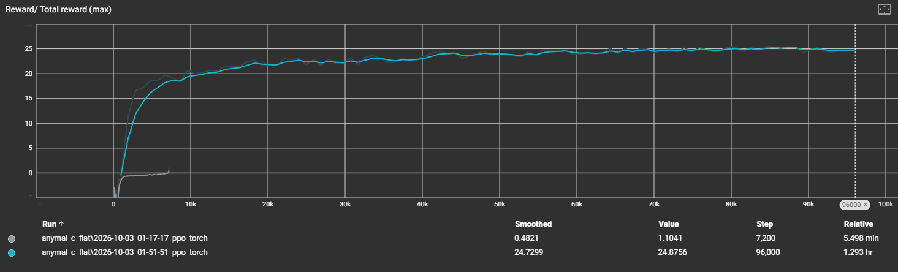 | 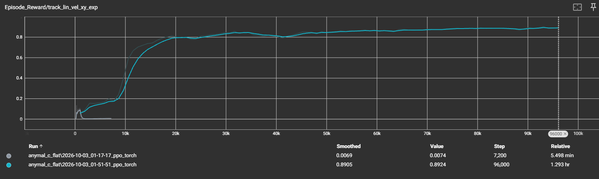 |
| 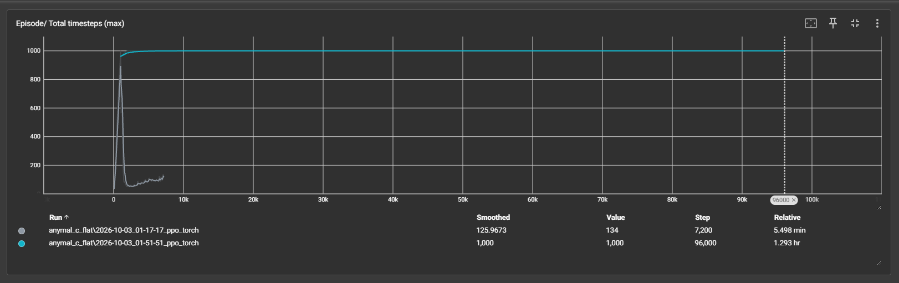 | |

（灰色是 300 轮欠训练基线：reward 1.1、episode 134 步、跟踪 0.007；蓝色是完整训练）

### 训练规模

| 项 | 值 |
|---|---|
| 并行环境 | 1024 |
| 迭代轮数 | 4000（× 24 步/轮 = 96000 策略步） |
| **总环境步数** | **≈ 9800 万步** |
| 训练耗时 | **1.29 小时**（RTX 4060 8GB） |
| 算法 | PPO（skrl）：rollouts 24 / epochs 5 / minibatches 4 / γ 0.99 / λ 0.95 / lr 1e-3（KLAdaptiveLR） |
| 网络 | Actor 与 Critic 各为 3 层 MLP（128-128-128，ELU） |

### Isaac Sim 中的训练现场

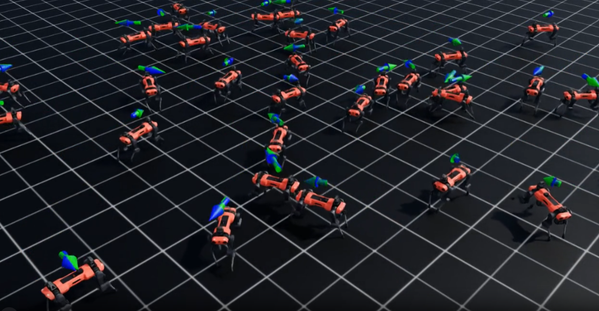

### 模型导出

| 项 | 值 |
|---|---|
| 导出格式 | ONNX（opset 17，动态 batch） |
| **ONNX vs PyTorch 最大误差** | **9.537e-07** |
| 输入 / 输出 | 48 维观测 → 12 维动作 |
| 观测归一化 | 无（`state_preprocessor: null`），部署链路最简 |

### 跨引擎验证（MuJoCo sim2sim）

把同一份 `.onnx` 权重放进 **MuJoCo**（与训练用的 PhysX 完全不同的物理引擎）运行：

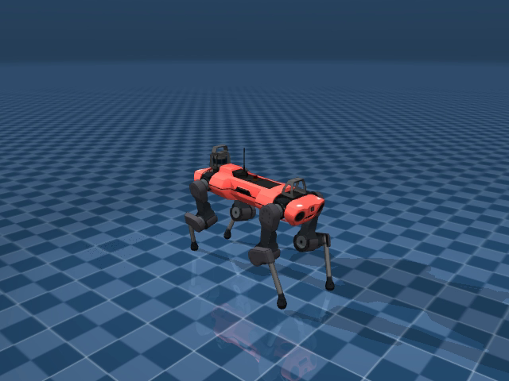

| 指令 vx | vy | wz | 存活 | 实测 vx | 行走距离 |
|---|---|---|---|---|---|
| 0.00 | 0.00 | 0.00 | 20.00 s | −0.007 | 0.35 m |
| **0.80** | 0.00 | 0.00 | 20.00 s | **0.825** | 6.34 m |
| **1.00** | 0.00 | 0.00 | 20.00 s | **1.008** | 7.71 m |
| **−0.60** | 0.00 | 0.00 | 20.00 s | **−0.671** | 5.19 m |
| 0.00 | 0.50 | 0.00 | 20.00 s | — | 4.10 m |
| 0.60 | 0.00 | 0.60 | 20.00 s | 0.642 | 4.92 m |

**6/6 跑满 20 秒不摔，前进速度跟踪误差平均 0.036 m/s。** 视频见 `assets/sim2sim.mp4`。

### 推力鲁棒性评估

对训练好的策略施加**周期性外部推力扰动**（每 2–4 秒一次 ±v m/s 的速度突变，模拟推搡/磕碰），
统计 20 秒 episode 内的摔倒率与速度跟踪误差（64 并行环境，每档约 200 个 episode）：

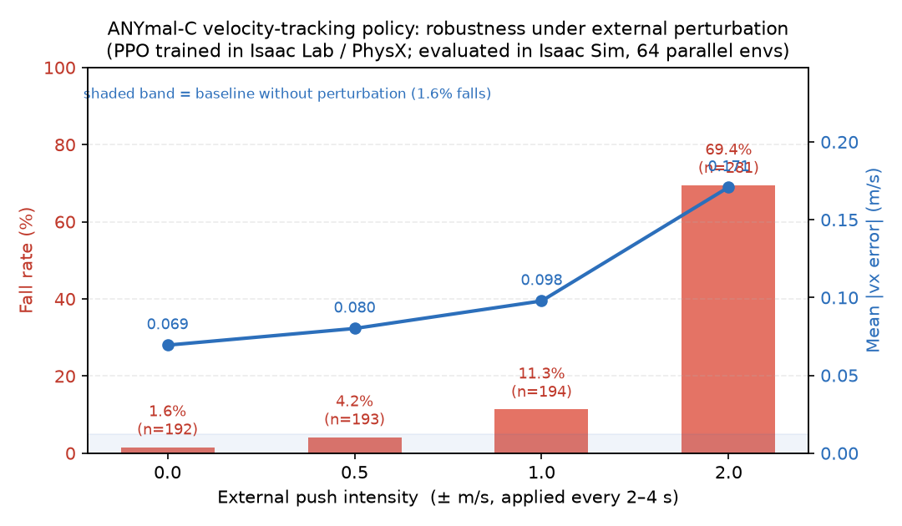

| 推力强度 (±m/s) | episodes | 摔倒数 | **摔倒率** | 平均跟踪误差 |
|---|---|---|---|---|
| 0.0（基线） | 192 | 3 | **1.6%** | 0.069 m/s |
| 0.5 | 193 | 8 | **4.2%** | 0.080 m/s |
| 1.0 | 194 | 22 | **11.3%** | 0.098 m/s |
| 2.0 | 281 | 195 | **69.4%** | 0.171 m/s |

**结论**：策略在 ±0.5 m/s 扰动下仍有 **96%** 的存活率，±1.0 m/s 下保持 **89%**，
但在 ±2.0 m/s（约为最大指令速度的 2 倍）时下降到 **31%**，且跟踪误差翻倍 ——
说明该策略具备中等强度扰动的鲁棒性，但**未显式训练抗强扰动**（训练时推力间隔为 10–15 秒、
幅度仅 ±0.5 m/s）。这也直接给出了下一步改进方向：加大域随机化强度。

> 原始数据：`robustness.csv` ｜ 评估脚本：`robustness_eval.py`

### 消融实验：抗扰动训练（Ablation）

上面的评估直接给出了弱点（±2.0 m/s 时摔倒率 69%），于是**用同样的配置重训一版，只把扰动训练强度提上去**：

| 训练配置 | 扰动间隔 | 扰动幅度 |
|---|---|---|
| 原始策略 | 10–15 s | ±0.5 m/s |
| **抗扰动策略** | **2–4 s** | **±1.5 m/s** |

其余完全一致（1024 环境 × 4000 轮 ≈ 9800 万步，1.29 小时）。

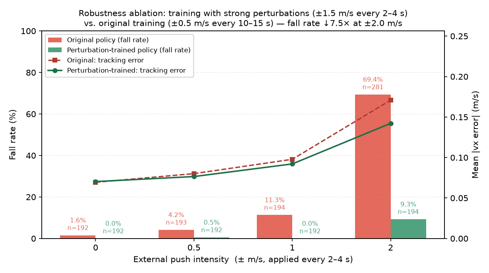

| 推力强度 | 原策略摔倒率 | **抗扰动策略** | 跟踪误差（原 → 新） |
|---|---|---|---|
| 0.0（基线） | 1.6% | **0.0%** | 0.069 → 0.070 m/s |
| ±0.5 m/s | 4.2% | **0.5%** | 0.080 → 0.077 m/s |
| ±1.0 m/s | 11.3% | **0.0%** | 0.098 → 0.092 m/s |
| **±2.0 m/s** | **69.4%** | **9.3%（↓7.5×）** | 0.171 → **0.142 m/s** |

**结论**：仅把域随机化强度提高（幅度 ×3、频率 ×4），在**几乎零跟踪性能代价**（基线误差 0.069 → 0.070 m/s）的前提下，
把 ±2.0 m/s 强扰动下的摔倒率从 **69.4% 降到 9.3%**，且跟踪误差在扰动下反而更低（0.171 → 0.142）。
说明该任务的鲁棒性瓶颈在**训练分布覆盖不足**，而非策略容量。

> 复现命令：训练时加 `env.events.push_robot.interval_range_s="[2.0,4.0]"` 与
> `env.events.push_robot.params.velocity_range.x/y="[-1.5,1.5]"`；评估见 `robustness_eval.py`，数据在 `robustness_robust.csv`。

### 地形泛化：平地 vs 崎岖地形

保持**超参、网络结构、训练规模完全一致**，只把任务换成 `Isaac-Velocity-Rough-Anymal-C-v0`
（崎岖石块地形；观测额外包含 17×11 的**地形高度扫描**，维度从 48 → **235**），从头训练
4000 轮 / 9800 万步 / **2.45 小时**：

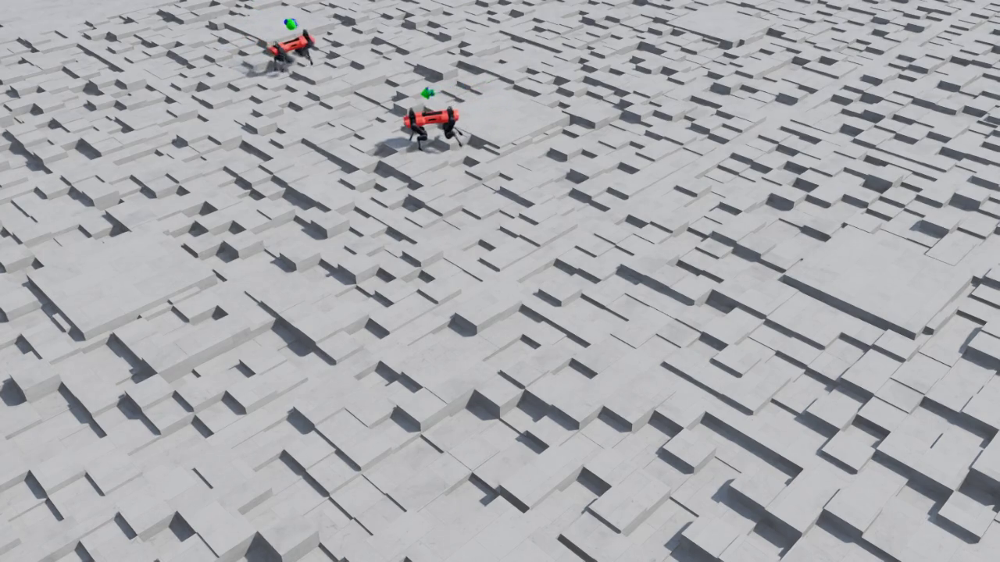

视频：`assets/rough_terrain_walk.mp4`（10 秒，机器人跨越随机高差石块）

| 指标 | 平地（抗扰动策略） | 崎岖地形 | 变化 |
|---|---|---|---|
| Episode 长度 (mean) | 969.6 / 1000 | **884.4 / 1000** | −8.8% |
| Episode 长度 (max) | 1000 | **1000** | — |
| Reward (mean) | 18.16 | 12.32 | −32% |
| `track_lin_vel_xy_exp` | 0.817 | **0.645** | −21% |
| `track_ang_vel_z_exp` | 0.438 | 0.370 | −16% |

**结论**：

1. 同一套训练配置**无需改动即可跨地形复用** —— 崎岖地形上最好环境仍能撑满 20 秒，平均存活时长达标称的 **88%**；
2. 代价是速度跟踪精度下降约 **21%**、平均奖励下降 **32%**，与"复杂地形上需以跟踪精度换取稳定性"的预期一致；
3. 观测维度的变化（48 → 235，引入地形高度扫描）是策略能适应地形的前提 —— 这也是崎岖地形任务**无法直接复用平地权重**的原因。

### 部署栈：ROS2 + 硬件约束验证（第 ③ 阶段）

把策略做成**可与真机对接的实时控制器**，并在仿真里量化部署边界（完整说明见 [`deploy/README.md`](deploy/README.md)）：

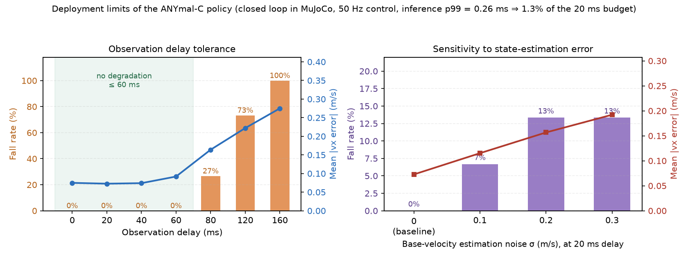

**算力与实时性**（ONNX / CPU，单次推理）：

| 项 | 数值 |
|---|---|
| 策略推理 p99 | **0.26 ms** |
| 整环耗时（推理 + 4 步物理）p99 | **1.2 ms** |
| 占 20 ms 控制周期 | **≈ 6%** ✅ |

**观测延迟容限**（每档 15 个 20 秒 episode）：

| 延迟 | 0 / 20 / 40 / 60 ms | 80 ms | 120 ms | 160 ms |
|---|---|---|---|---|
| 摔倒率 | **0%** | 26.7% | 73.3% | 100% |
| 跟踪误差 | 0.073–0.092 m/s | 0.164 | 0.222 | 0.275 |

→ **延迟容限 ≈ 80 ms**：真机部署时「控制周期 + 感知/估计链路」总延迟应控制在 **60 ms 内**。

**状态估计误差敏感性**（真机上 `base_lin_vel` 来自状态估计器，是主要误差源）：

| 估计噪声 σ | 0（基线） | 0.1 m/s | 0.2 m/s | 0.3 m/s |
|---|---|---|---|---|
| 摔倒率 | 0% | 6.7% | 13.3% | 13.3% |
| 跟踪误差 | 0.073 | 0.115 | 0.157 | 0.192 |

→ 速度估计误差 σ ≥ 0.1 m/s 即产生可观测损失，真机部署应优先保证状态估计精度。

**ROS2 接口**（`deploy/ros2_policy_node.py` + `deploy/ros2_sim_node.py`，MuJoCo 扮演被控对象）：

| 话题 | 类型 | 说明 |
|---|---|---|
| `/joint_states` | `sensor_msgs/JointState` | 12 关节角/角速度（按腿分组顺序） |
| `/imu` | `sensor_msgs/Imu` | 角速度 + 姿态 → 重力方向 |
| `/odom` | `nav_msgs/Odometry` | **机体系线速度**（真机由状态估计器提供） |
| `/cmd_vel` | `geometry_msgs/Twist` | vx / vy / wz 指令 |
| `/joint_command` | `sensor_msgs/JointState` | 12 关节目标角（50 Hz） |

**ROS2 闭环实测**（WSL2 + ROS2 Humble，两个独立节点通过话题通信）：控制周期均值 **20.00 ms** / p99 **20.50 ms**
（抖动 2.5%）、单次推理 **0.09 ms**（占周期 0.45%）、`ros2 topic hz /joint_command` = **49.3 Hz**；
观察到一次 0.6 s 调度离群 —— 真机部署必须加看门狗。详见 [`deploy/README.md`](deploy/README.md)。

---

## 3. 系统架构

```
Isaac Sim 5.1 (PhysX)                      MuJoCo 3.14
┌─────────────────────────────┐           ┌──────────────────────────┐
│ 1024 并行环境                │           │ 单机器人 (CPU 物理)       │
│ ANYmal-C, 12 DOF, 50 Hz      │           │ 同款 MJCF 模型            │
│        ↓ PPO (skrl)          │           │        ↓ onnxruntime     │
│   策略网络 48→128×3→12       │  ──ONNX──▶│  同一份 policy.onnx       │
│        ↓                     │  9.5e-07  │        ↓ PD 执行器        │
│ checkpoint (best_agent.pt)   │           │ 速度跟踪评估 + 录像       │
└─────────────────────────────┘           └──────────────────────────┘
```

**任务定义（`Isaac-Velocity-Flat-Anymal-C-v0`）**

| 项 | 内容 |
|---|---|
| 观测（48 维） | `base_lin_vel(3) + base_ang_vel(3) + projected_gravity(3) + velocity_commands(3) + joint_pos_rel(12) + joint_vel_rel(12) + last_action(12)`，无缩放 |
| 动作（12 维） | 关节目标位置 = **默认关节角 + 0.5 × 策略输出** |
| 控制频率 | **50 Hz**（物理步长 0.005 s × decimation 4） |
| Episode | 20 秒 |
| 终止条件 | 超时 / 机身接触地面 |
| 奖励 | 线速度跟踪 + 角速度跟踪 + 抬腿时间 −（机身竖直速度、角速度、力矩、加速度、动作变化率、不当接触、机身倾斜） |

---

## 4. 技术栈

| 层 | 组件 |
|---|---|
| 仿真 | Isaac Sim 5.1.0（Windows 原生，D3D12）· Isaac Lab · MuJoCo 3.14 |
| RL | skrl（PPO）· PyTorch 2.7.0+cu128 |
| 部署 | ONNX（opset 17）· onnxruntime |
| 可视化/分析 | TensorBoard · imageio/ffmpeg |
| 硬件 | RTX 4060 8GB · i5-11400 · Windows 10 · NVIDIA 580.88（Isaac Sim 官方验证驱动） |

---

## 5. 复现步骤

环境变量（下同）：

| 占位符 | 含义 |
|---|---|
| `<ISAACLAB_PATH>` | Isaac Lab 安装目录（含 `isaaclab.bat`），例如 `E:\IsaacLab` |
| `<PROJECT_PATH>` | 本仓库目录 |
| `<MENAGERIE_PATH>` | `mujoco_menagerie` 解压目录（含 `anybotics_anymal_c/`） |

```powershell
# 1) 训练（约 1.3 小时）
<ISAACLAB_PATH>\isaaclab.bat -p scripts\reinforcement_learning\skrl\train.py `
    --task=Isaac-Velocity-Flat-Anymal-C-v0 --headless --num_envs 1024 --max_iterations 4000

# 2) 看曲线
<ISAACLAB_PATH>\_isaac_sim\kit\python\Scripts\tensorboard.exe --logdir <ISAACLAB_PATH>\logs\skrl --port 6006

# 3) 导出 ONNX（脚本见 export_onnx.py，误差 9.5e-07）
<ISAACLAB_PATH>\_isaac_sim\kit\python\python.exe <PROJECT_PATH>\export_onnx.py

# 4) 跨引擎验证 + 录像
<ISAACLAB_PATH>\_isaac_sim\kit\python\python.exe <PROJECT_PATH>\anymal_sim2sim.py `
    --model <MENAGERIE_PATH>\anybotics_anymal_c\scene.xml `
    --policy <PROJECT_PATH>\policy.onnx --video sim2sim.mp4

# 5) 推力鲁棒性评估（每档一个强度，结果追加到 CSV）
<ISAACLAB_PATH>\isaaclab.bat -p <PROJECT_PATH>\robustness_eval.py --headless `
    --actor <ISAACLAB_PATH>\deploy\actor.pt --intensity 0.0 --num_envs 64 --episodes 3 --csv robustness.csv
```

**部署栈（第③阶段）**：见 [`deploy/README.md`](deploy/README.md)（WSL2 + ROS2 Humble 的完整步骤）。

---

## 6. 工程难点与解决（这部分是项目里真正花时间的地方）

### 6.1 跨引擎关节顺序不一致

Isaac Lab 的 articulation 顺序是**按关节类型分组、组内 LF→LH→RF→RH**：

```
LF_HAA, LH_HAA, RF_HAA, RH_HAA, LF_HFE, LH_HFE, RF_HFE, RH_HFE, LF_KFE, LH_KFE, RF_KFE, RH_KFE
```

而 MuJoCo 的 MJCF 是**按腿分组**（`LF_HAA, LF_HFE, LF_KFE, RF_HAA, ...`）。
顺序错一个位置，机器人必然摔倒。**最终做法**：把 Isaac 侧的真实顺序与观测向量导出打印，
在 MuJoCo 里复现同一状态做 **48 维逐元素对比**，确认到 `1e-6` 量级后才继续。

### 6.2 执行器模型差异（sim2sim 的主要误差来源）

Isaac Lab 的 ANYmal-C 用 **ActuatorNet LSTM**（ANYdrive 3.0 的神经网络模型，含力矩饱和与动态特性），
MuJoCo 无法直接复现，只能用 PD 近似。实测扫描后取 **kp=120 / kd=5**（固件默认 100/1 也能走但误差大）：

| kp | kd | 存活 | 末段实测 vx（指令 0.8） |
|---|---|---|---|
| 40 | 5 | 20 s | 0.001（原地不动） |
| 80 | 1 | 20 s | 0.558 |
| **120** | **5** | **20 s** | **0.825** ✅ |
| 200 | 5 | 20 s | 0.934（略超调） |

### 6.3 MuJoCo 的坐标系 API 陷阱

`mj_objectVelocity(..., flg_local=1)` 的返回值有误（**对单位姿态都会返回轴循环置换后的向量**），
导致速度观测全错、策略原地不动。改为 `flg_local=0` 取世界系速度后，再用 `R.T @ v` 手动转到机体系。

### 6.4 为什么用 Windows 原生而不是 WSL2

WSL2 路线已完整验证不可行：`gpu.foundation` 无法创建 GPU 设备（缺少 Vulkan 光追能力），
且 Warp 无法创建 CUDA stream；NVIDIA 官方明确 **[Isaac Sim 不支持在 WSL2 下运行](https://forums.developer.nvidia.com/t/is-it-possible-to-run-isaac-sim-in-wsl2/349609)**。
改用 **Windows 原生 + Isaac Sim 二进制版**（D3D12）后全部正常。
另外：驱动必须使用官方验证版本 **580.88** —— 用更新的 610.88 时 RTX 渲染器会在启动时崩溃
（`rtx.scenedb.plugin`），且**无头训练正常、一启用渲染就崩**，完整排查记录见
[`docs/wsl2-isaac-failure-report.md`](docs/wsl2-isaac-failure-report.md)。

---

## 7. 项目边界与下一步

**已完成（本仓库范围）**

- [x] Isaac Lab + Isaac Sim 5.1 环境搭建（Windows 原生，含驱动/依赖问题排查）
- [x] skrl PPO 训练 9800 万步，速度跟踪奖励 0.89
- [x] TensorBoard 全程指标记录
- [x] ONNX 导出 + 数值一致性验证（9.5e-07）
- [x] **MuJoCo 跨引擎 sim2sim 验证（6/6，误差 0.036 m/s）**
- [x] **推力鲁棒性量化评估**（4 档扰动强度，约 860 个 episode；输出鲁棒性衰减曲线）
- [x] **抗扰动训练消融实验**：加大域随机化后，±2.0 m/s 扰动下摔倒率 **69.4% → 9.3%**，且跟踪性能无损失
- [x] **地形泛化**：同一配置在崎岖地形（观测 235 维）从头训练，平均存活率达标称的 88%，代价是跟踪精度 −21%
- [x] **部署就绪栈（第③阶段）**：ROS2 节点（50 Hz，`/joint_states` `/imu` `/odom` `/cmd_vel` → `/joint_command`）+ MuJoCo 被控对象闭环；
      实测推理 p99 **0.26 ms**（占 20 ms 周期 6%）、**观测延迟容限 ≈ 80 ms**、量化了状态估计噪声敏感性；
      **ROS2 闭环实测**：控制周期 p99 **20.5 ms**（抖动 2.5%）、`/joint_command` **49.3 Hz**

**未完成（后续路线）**

- [ ] **真机验证（第④阶段）**：需要 ANYmal-C 硬件（ANYdrive 力矩接口 + 实际状态估计器）；
      接口、频率、算力、延迟容限已在第③阶段量化，属于"只差硬件"
- [ ] 训练阶段进一步加大域随机化（地形 + 推力 + 观测延迟**联合**随机化），提升实际部署余量
- [ ] 奖励权重敏感性实验（`dof_torques_l2` / `feet_air_time` 等单变量对比）
- [ ] PPO 超参单变量实验（熵系数 / 学习率 / `num_envs` 的样本效率对比）

> **说明**：本项目在仿真层面完成，**未接入真机**。跨引擎 sim2sim 与 ROS2 部署栈已覆盖 sim2real 链条的前三步
> （模型导出 → 物理引擎泛化 → 部署就绪与边界量化），第④步需要硬件接入。

---

## 8. 文件结构

```
anymal-c-locomotion-rl/
├── README.md                    # 本文档
├── requirements.txt             # 依赖与版本（含 pillow 版本陷阱说明）
├── .gitignore
├── anymal_sim2sim.py            # 跨引擎验证脚本（Isaac Lab 训练策略 → MuJoCo）
├── export_onnx.py               # checkpoint → ONNX 导出 + 数值验证
├── robustness_eval.py           # 推力鲁棒性评估（多档强度 → 摔倒率/跟踪误差）
├── robustness.csv               # 鲁棒性数据：原始策略
├── robustness_robust.csv        # 鲁棒性数据：抗扰动策略
├── policy.onnx                  # 导出的策略（48→12 全连接 ELU 网络）
├── deploy/                      # 【第③阶段】部署栈：ROS2 节点 + 硬件约束验证
│   ├── README.md                #   部署结果、ROS2 接口、WSL 运行步骤、与真机的差距
│   ├── anymal_core.py           #   核心：关节映射 / 观测拼装 / 动作转换（真机复用的唯一文件）
│   ├── anymal_plant.py          #   MuJoCo 被控对象（200 Hz 物理）
│   ├── closed_loop.py           #   本地闭环评估：延迟容限、估计噪声、时序
│   ├── ros2_policy_node.py      #   ROS2 策略节点（50 Hz）
│   ├── ros2_sim_node.py         #   ROS2 被控对象节点（MuJoCo 模拟真机）
│   ├── deploy_eval.csv          #   部署评估原始数据（Windows）
│   └── deploy_eval_wsl.csv      #   部署评估原始数据（WSL2，跨平台复现）
├── assets/
│   ├── hero_sim2sim.gif         # 首屏：MuJoCo 跨引擎行走
│   ├── hero_rough_terrain.gif   # 首屏：崎岖地形行走
│   ├── curve_reward.png         # 训练曲线：总奖励
│   ├── curve_track_lin_vel.png  # 训练曲线：速度跟踪
│   ├── curve_episode_length.png # 训练曲线：episode 长度
│   ├── isaac_sim_training_scene.png  # Isaac Sim 训练现场
│   ├── mujoco_walking.png       # MuJoCo sim2sim 行走（静帧）
│   ├── robustness_curve.png     # 鲁棒性衰减曲线（原始策略）
│   ├── robustness_ablation.png  # 消融对比：原始 vs 抗扰动训练
│   ├── deployment_limits.png    # 部署边界：观测延迟容限 + 估计噪声敏感性
│   ├── rough_terrain.png        # 崎岖地形行走（静帧）
│   ├── rough_terrain_walk.mp4   # 崎岖地形行走视频
│   └── sim2sim.mp4              # sim2sim 视频（20 秒行走）
└── docs/
    └── wsl2-isaac-failure-report.md   # WSL2 路线不可行性的完整排查记录（见 6.4 节）
```

---

## 9. 参考

- Isaac Lab: <https://github.com/isaac-sim/IsaacLab>
- skrl: <https://skrl.readthedocs.io>
- MuJoCo / mujoco_menagerie (ANYmal-C 模型): <https://github.com/google-deepmind/mujoco_menagerie>
- Isaac Sim 5.1 系统需求（驱动 580.88）: <https://docs.isaacsim.omniverse.nvidia.com/5.1.0/installation/requirements.html>
- Isaac Sim 不支持 WSL2（官方说明）: <https://forums.developer.nvidia.com/t/is-it-possible-to-run-isaac-sim-in-wsl2/349609>

